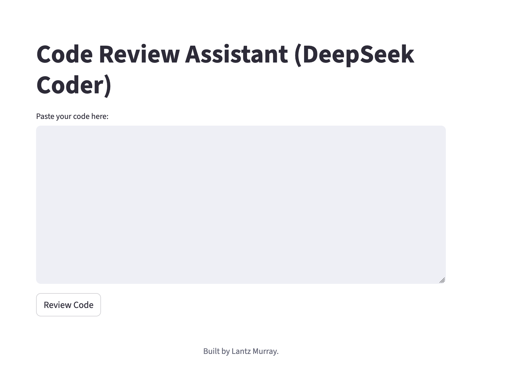

# Project 4: Code Review Assistant (DeepSeek-Coder)

An AI-powered code review assistant that analyzes code and provides feedback, improvement suggestions, and bug fixes. Perfect for developers, code reviewers, and engineering teams.

## Screenshot



## Features

- **Code-Specialized LLM**: Uses DeepSeek-Coder model optimized for code analysis
- **Automated Feedback**: Provides constructive code review feedback
- **Bug Detection**: Identifies potential issues and bugs
- **Improvement Suggestions**: Suggests code refactoring and optimization
- **FastAPI Backend**: Efficient REST API for code processing
- **Streamlit Frontend**: User-friendly interface for code input
- **Local Processing**: All analysis runs locally using Ollama LLMs - no external API dependencies

## Architecture

### Backend Components

1. **Code Analyzer** (`backend/main.py`)
   - Analyzes code structure and patterns
   - Identifies potential bugs
   - Suggests improvements

2. **Feedback Generator** (`backend/main.py`)
   - Provides constructive review feedback
   - Identifies strengths and weaknesses
   - Generates actionable recommendations

3. **Bug Detector** (`backend/main.py`)
   - Scans for common coding issues
   - Highlights problematic areas
   - Suggests fixes

### Frontend Components

1. **Streamlit UI** (`frontend/app.py`)
   - User interface for code input
   - Results display and visualization
   - Export functionality

2. **Reusable Components** (`frontend/components.py`)
   - Modular UI elements
   - Consistent styling and layout

## Installation

### Prerequisites

- Python 3.8 or higher
- Ollama installed and running (for local LLM inference)

### Setup Steps

1. **Navigate to the project directory**:
   ```bash
   cd SchoolOfAI/Official/soai-04-code-review
   ```

2. **Create a virtual environment**:
   ```bash
   python -m venv venv
   source venv/bin/activate  # On Windows: venv\Scripts\activate
   ```

3. **Install dependencies**:
   ```bash
   pip install -r requirements.txt
   ```

4. **Install and start Ollama** (if not already installed):
   ```bash
   # Install Ollama from https://ollama.com
   # Pull DeepSeek-Coder model
   ollama pull deepseek-coder
   # Start Ollama service
   ollama serve
   ```

## Running the Application

### Backend API

1. **Start the FastAPI backend**:
   ```bash
   uvicorn backend.main:app --reload
   ```

2. **Access the API**: Navigate to `http://localhost:8000` for API documentation

### Frontend UI

1. **Start the Streamlit application** (in a new terminal):
   ```bash
   streamlit run frontend/app.py
   ```

2. **Open your browser**: Navigate to `http://localhost:8501`

## Usage

### 1. Input Code

- Paste code in the text area
- Or upload a code file
- Select programming language (optional)

### 2. Analyze Code

- Click "Analyze" to process the code
- Wait for the AI to generate insights
- View the comprehensive results

### 3. Review Results

- **Code Quality**: Overall assessment of code quality
- **Bug Report**: List of potential issues found
- **Improvements**: Suggestions for refactoring and optimization
- **Best Practices**: Recommendations for following coding standards

### 4. Export Results

- Copy feedback for sharing
- Export analysis as text or JSON
- Save for future reference

## Workflow

```
Input Code → Backend API → DeepSeek-Coder → Generate Analysis → Display Results
     ↓              ↓            ↓                ↓                  ↓
  Paste code     FastAPI      Call model      Extract bugs,    Show to
  or file        endpoint     with prompt   improvements      user
```

## Configuration

### Environment Variables (Optional)

Create a `.env` file in the project root:

```env
OLLAMA_MODEL=deepseek-coder
OLLAMA_API_URL=http://localhost:11434/api/generate
```

### Ollama Models

The system supports any Ollama model. Recommended models:
- `deepseek-coder` - Code-specialized model optimized for code analysis (default)

## Project Structure

```
soai-04-code-review/
├── backend/
│   └── main.py                  # FastAPI backend
├── frontend/
│   ├── app.py                    # Streamlit UI
│   └── components.py             # Reusable UI components
├── requirements.txt              # Python dependencies
└── README.md                   # This file
```

## Dependencies

- `fastapi` - Web API framework
- `uvicorn` - ASGI server
- `streamlit` - Web UI framework
- `requests` - HTTP client for Ollama API
- `python-dateutil` - Date/time parsing

## Troubleshooting

### Ollama Connection Issues

If you see connection errors:
1. Verify Ollama is running: `ollama list`
2. Check the API URL: `curl http://localhost:11434/api/generate`
3. Ensure the model is pulled: `ollama pull deepseek-coder`

### Backend API Issues

If the backend isn't responding:
1. Verify uvicorn is running: `ps aux | grep uvicorn`
2. Check the port isn't in use: `lsof -i :8000`
3. Review backend logs for errors

### Frontend Connection Issues

If the frontend can't connect to the backend:
1. Verify both services are running
2. Check the API URL in frontend/app.py
3. Ensure CORS is configured correctly

### Analysis Issues

If code analysis isn't working properly:
1. Check that the code is complete and well-formatted
2. Verify the LLM model is appropriate for code analysis
3. Review the prompts in backend/main.py
4. Try with a different model

### Slow Performance

For faster analysis:
1. Use a smaller code sample
2. Increase Ollama's GPU resources if available
3. Process code in smaller chunks

## Use Cases

- **Code Review**: Automated code review for pull requests
- **Code Quality**: Assess code quality and maintainability
- **Bug Detection**: Identify potential issues before deployment
- **Learning**: Get feedback on code improvements
- **Documentation**: Generate code documentation suggestions
- **Best Practices**: Ensure code follows industry standards

## Important Notes

- All processing happens locally - no code is sent to external servers
- Analysis quality depends on the completeness and quality of the code
- Bug detection is AI-based and should be verified by developers
- Improvement suggestions are AI-generated and should be reviewed
- DeepSeek-Coder is optimized for code-related tasks

## License

This project is part of the School of AI curriculum.
